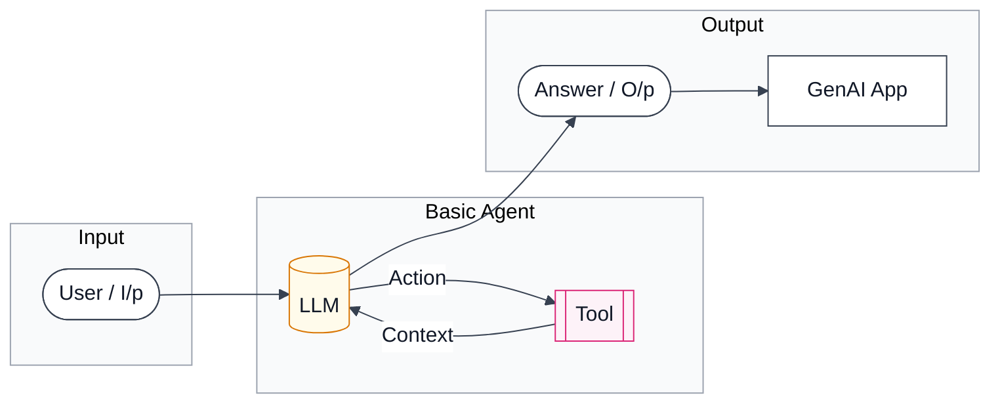
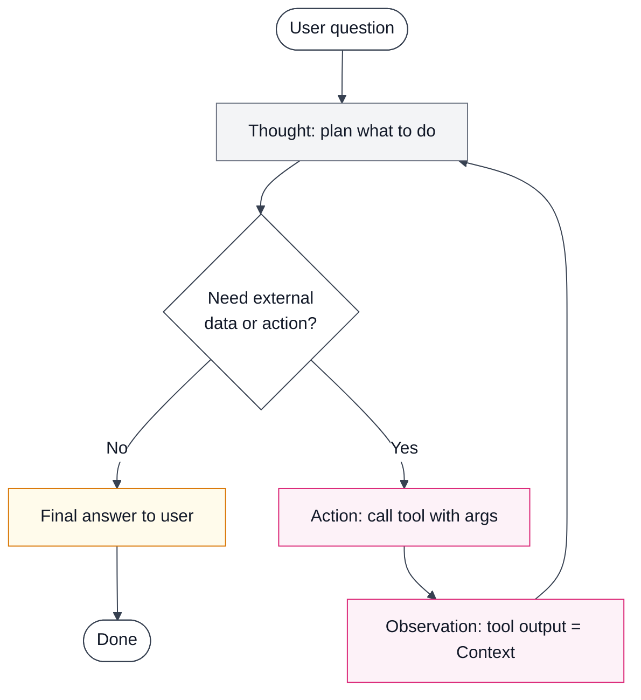
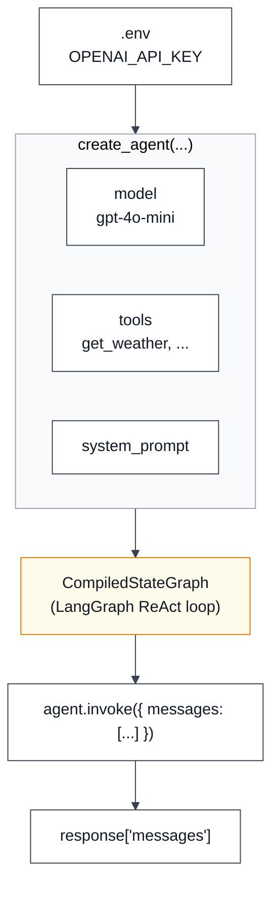
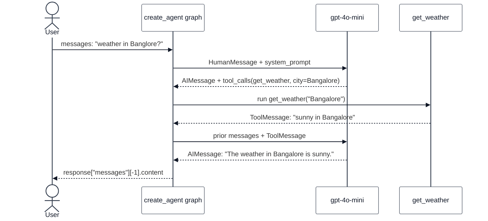
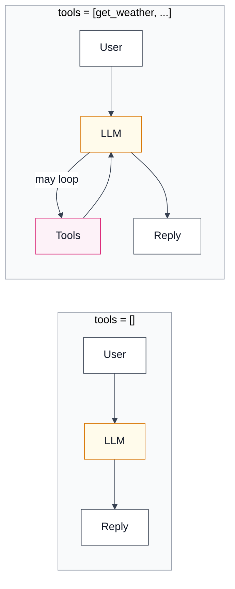
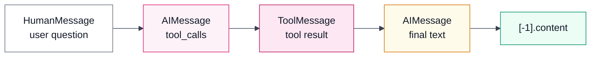
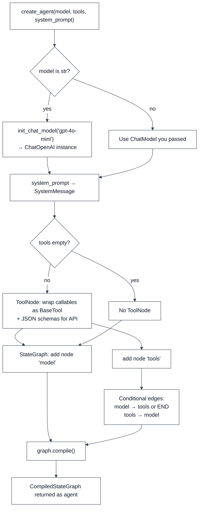
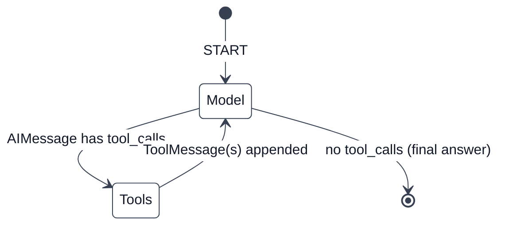
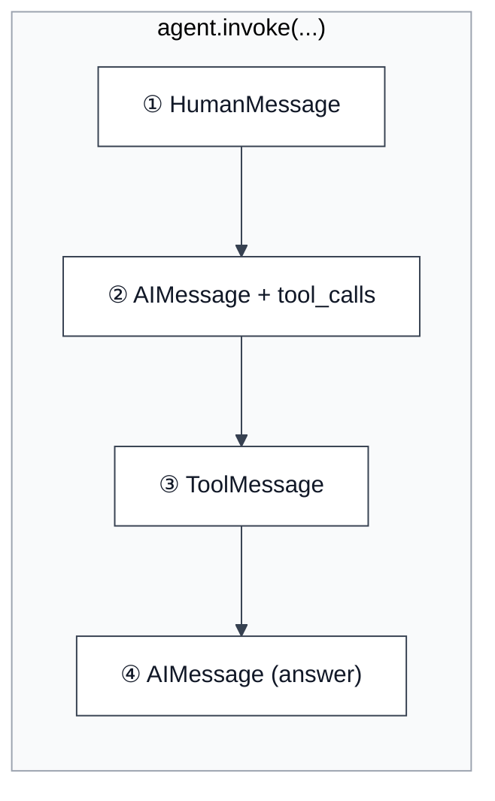
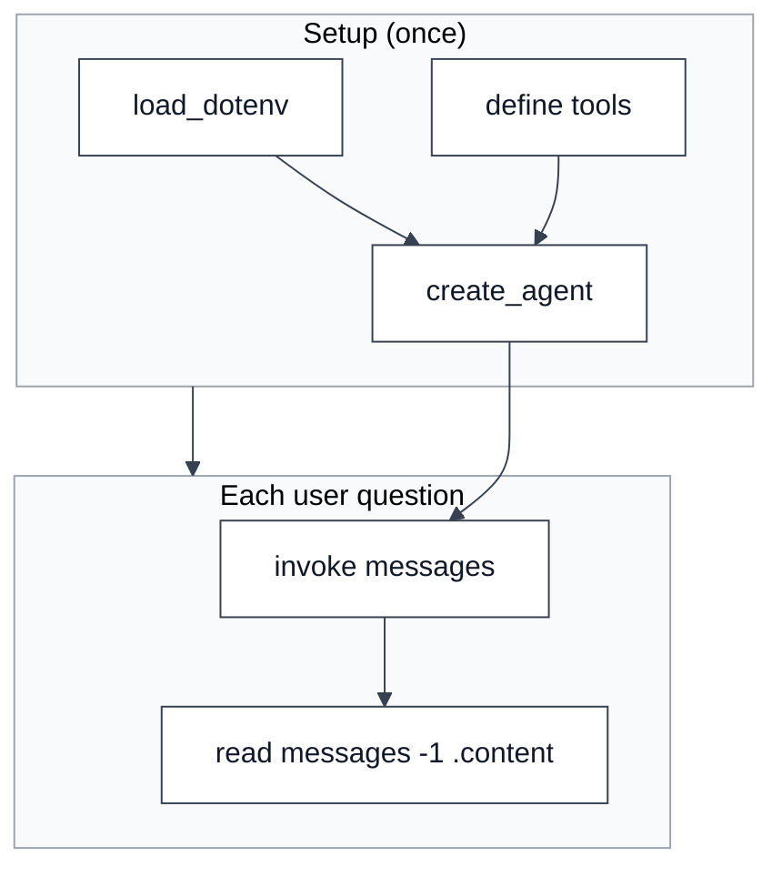

# Agents & ReAct — reference

Visual notes aligned with your training diagram (LLM ↔ Tool loop, ReAct, GenAI app).

| File | Use |
|------|-----|
| `agents-react-reference.png` | Quick glance / slides / phone |
| `agents-react-reference.svg` | Zoom without blur; edit in Figma/Inkscape |

**Notebook walkthrough:** [`1-langchainintro.ipynb`](../1-langchainintro.ipynb) (LangChain `1.3.x`)

> **Tip:** Mermaid diagrams below render in GitHub, Cursor, and VS Code (Markdown Preview). For a printable poster, use `agents-react-reference.png` / `.svg`.

---

## Diagrams

Charts use a **light theme** (white / light-gray boxes, **dark text**) for readability in Markdown Preview and GitHub.

<!-- Mermaid light theme: prepend to each chart -->
<!-- %%{init: {"theme":"base","themeVariables":{"primaryColor":"#ffffff","primaryTextColor":"#111827","primaryBorderColor":"#374151","lineColor":"#374151","secondaryColor":"#f3f4f6","tertiaryColor":"#fffbeb","mainBkg":"#ffffff","nodeTextColor":"#111827","clusterBkg":"#f9fafb","clusterBorder":"#9ca3af","actorBkg":"#ffffff","actorTextColor":"#111827","signalColor":"#111827"}}}%% -->

### 1. Training diagram — Basic Agent + GenAI App



### 2. ReAct loop (Thought → Action → Observation)



### 3. LangChain `create_agent` — what you assemble



### 4. Sequence — your notebook (`get_weather` / Bangalore)



### 5. Agent with tools vs chat-only



### 6. Message types in `response["messages"]`



---

## Core idea (from your diagram)

```
User question (I/p) → LLM → [optional] Tool → Context back → LLM → Answer (O/p) → GenAI App
```

**Basic agent** = one LLM that can call tools in a loop until it can answer.

**ReAct** = **Re**ason (Thought) + **Act** (call tool) + read **Observation** (Context), then repeat.

---

## How to create an agent in LangChain (summary)

This matches what you build in `1-langchainintro.ipynb` using **`langchain.agents.create_agent`** (LangChain **1.3+**). Under the hood you get a **LangGraph** `CompiledStateGraph` that runs the ReAct loop for you.

---

## How `create_agent` works internally

**Yes — `create_agent` is the factory that builds your agent.** It does not run the LLM itself at import time; it **wires up** a runnable graph you call later with `agent.invoke(...)`.

Source (your install): `langchain/agents/factory.py` → returns `CompiledStateGraph`.

### What it is (one sentence)

`create_agent` = **configure model + tools + system prompt → compile a LangGraph state machine** that loops **model → tools → model** until the LLM stops requesting tools.

### Build-time pipeline (when you call `create_agent(...)`)



| Step | What LangChain does |
|------|---------------------|
| **1. Model** | String `"gpt-4o-mini"` → `init_chat_model()` → `ChatOpenAI` (reads `OPENAI_API_KEY`). |
| **2. System prompt** | `str` → `SystemMessage` prepended on every LLM call. |
| **3. Tools** | Each function → `BaseTool` with name, description (docstring), args schema. |
| **4. Bind tools** | Before each LLM call: `model.bind_tools(tools)` so the API receives tool definitions. |
| **5. Graph nodes** | `"model"` node = call LLM; `"tools"` node = `ToolNode` runs Python functions. |
| **6. Edges** | If last `AIMessage` has `tool_calls` → go to `"tools"`; else → **END**. After tools → back to `"model"`. |
| **7. Compile** | `graph.compile()` → object you store in `agent`. |

If `tools=[]`, there is **no** `"tools"` node and **no** tool loop — one model call per `invoke` (chatbot).

### Runtime pipeline (when you call `agent.invoke(...)`)

**State** is mainly `{ "messages": [...] }` — the growing chat + tool history.



**Inside the `"model"` node** (simplified):

1. Read `state["messages"]`.
2. Prepend `system_message` if you set `system_prompt`.
3. `bound_model.invoke(messages)` → HTTP to OpenAI (or other provider).
4. Append returned `AIMessage` to state.

**Inside the `"tools"` node**:

1. Read `tool_calls` from the last `AIMessage`.
2. For each call: run `get_weather(**args)` (your Python code).
3. Append `ToolMessage` per result (linked by `tool_call_id`).

Then the graph routes back to `"model"` with the longer message list — that is the **Context** from your training diagram.

### How the agent “talks” to the LLM (and back)

| Direction | Mechanism | You see it as |
|-----------|-----------|----------------|
| **Agent → LLM** | `model_node` builds message list + calls `model.invoke()` | New `AIMessage` in `response["messages"]` |
| **LLM → Agent** | Parsed API response: text + optional `tool_calls` | `AIMessage.tool_calls`, `finish_reason: tool_calls` |
| **Agent → Tool** | `ToolNode` executes registered tools | Side effect + `ToolMessage` |
| **Tool → Agent** | Return string stored in `ToolMessage.content` | Next model turn includes that text |
| **Agent → You** | Graph ends; full `messages` in return dict | `response["messages"][-1].content` |

The LLM never imports your notebook. It only sees **serialized messages + tool schemas**. LangChain is the **router** between API and Python.

### `create_agent` parameters (beyond your notebook)

| Parameter | Purpose |
|-----------|---------|
| `model` | Chat model id string or `ChatOpenAI` / `ChatGroq` instance |
| `tools` | Callables, `BaseTool`, or provider tool dicts |
| `system_prompt` | Steers behavior every turn |
| `middleware` | Hooks: before/after model, wrap tool calls, etc. |
| `checkpointer` | Persist thread state (multi-turn memory) |
| `response_format` | Structured output (Pydantic / JSON schema) |
| `interrupt_before` / `after` | Human-in-the-loop pauses |

### Mental model vs old tutorials

| Old (0.x / early 1.x) | Your version (1.3+) |
|------------------------|---------------------|
| `create_react_agent` + `AgentExecutor` | **`create_agent`** |
| Executor runs the loop | **LangGraph** runs the loop |
| Returns via `.run()` | **`agent.invoke({"messages": ...})`** |

### Prerequisites

1. **API key** in the repo-root `.env`:
   ```bash
   OPENAI_API_KEY=sk-...
   ```
2. **Load env** in the notebook (cell 1):
   ```python
   from dotenv import load_dotenv
   load_dotenv()  # or load from Path.cwd().parent / ".env"
   ```
3. **Packages** (already in `pyproject.toml`): `langchain`, `langchain-openai`, `python-dotenv`.

### Step 1 — Agent with no tools (chat-only)

Use this to confirm the model and env work. The agent behaves like a normal chat LLM.

```python
from langchain.agents import create_agent

agent = create_agent(
    model="gpt-4o-mini",
    tools=[],
    system_prompt="You are a helpful assistant.",
)
```

`agent` is a compiled graph — you **invoke** it, not `agent.run(...)`.

### Step 2 — Define a tool

Any callable the LLM can call. A **docstring** helps the model know when to use it.

```python
def get_weather(city: str) -> str:
    """Get the weather for a city."""
    return f"The weather in {city} is sunny."
```

For production tools, prefer real APIs (search, DB, HTTP) instead of hard-coded strings.

Optional: use the `@tool` decorator from `langchain.tools` for richer schemas and names.

### Step 3 — Create the agent with tools

```python
agent = create_agent(
    model="gpt-4o-mini",
    tools=[get_weather],
    system_prompt="You are a helpful assistant that can answer questions and help with tasks.",
)
```

| Parameter | Role |
|-----------|------|
| `model` | Model id string (e.g. `gpt-4o-mini`) or a chat model instance |
| `tools` | List of functions / `@tool` objects the agent may call |
| `system_prompt` | Instructions prepended to every run |

### Step 4 — Run the agent (`invoke`)

**Recommended input shape** (list of messages):

```python
response = agent.invoke({
    "messages": [
        {"role": "user", "content": "What is the weather like in Bangalore?"}
    ]
})
```

**Read the answer:**

```python
response["messages"][-1].content
# 'The weather in Bangalore is sunny.'
```

**Inspect the full ReAct trail:**

```python
for msg in response["messages"]:
    print(type(msg).__name__, getattr(msg, "content", "")[:80])
```

### What happens on `invoke` (maps to your diagram)

See **Diagrams §4 and §6** above for sequence and message flow.

| Step | Message type | Diagram |
|------|----------------|---------|
| 1 | `HumanMessage` | **I/p** — user question |
| 2 | `AIMessage` with `tool_calls` | **Action** — LLM chooses `get_weather(city=...)` |
| 3 | `ToolMessage` | **Context** — tool return value |
| 4 | `AIMessage` (no tool calls) | **O/p** — final natural-language answer |



Example from your notebook: Bangalore typo → model still called `get_weather` with `city='Bangalore'`; New York typo → `city='New York'`.

### Step 5 — Other models (same pattern)

```python
from langchain_openai import ChatOpenAI
from langchain_groq import ChatGroq
from langchain_google_genai import ChatGoogleGenerativeAI

agent = create_agent(
    model=ChatGroq(model="llama-3.1-8b-instant"),
    tools=[get_weather],
    system_prompt="...",
)
```

Ensure the matching key is in `.env` (`GROQ_API_KEY`, `GOOGLE_API_KEY`, etc.).

### Quick checklist

- [ ] `.env` loaded before `create_agent`
- [ ] `tools=[...]` only when the task needs external data or actions
- [ ] Each tool has a clear **docstring** (and typed args if possible)
- [ ] Invoke with `{"messages": [{"role": "user", "content": "..."}]}`
- [ ] Use `response["messages"][-1].content` for the final reply

### Common pitfalls

| Issue | Fix |
|-------|-----|
| `OPENAI_API_KEY` missing | Run env cell; check repo-root `.env` |
| Wrong `messages` shape | Use a **list** of `{role, content}` dicts, not a bare string |
| Tool never called | Improve docstring; ask a question that **requires** the tool |
| Old tutorials use `create_react_agent` | In LangChain 1.3+, use **`create_agent`** (this notebook) |

---

## Extra points (beyond the whiteboard)

1. **Why tools?** Weights are frozen at training time. “Today’s AI news” needs **live** data (search, RSS, APIs).
2. **Context** = tool output on the next LLM turn, not long-term memory by default.
3. **Agent vs chatbot** — an agent can **plan, act, observe, and retry**; a chatbot only replies once.
4. **When to stop** — loop ends when the model returns an answer with **no** `tool_calls`, or when max iterations is hit.

---

## LangChain building blocks (this repo)

| Piece | In your notebook |
|-------|------------------|
| LLM | `model="gpt-4o-mini"` (uses `OPENAI_API_KEY`) |
| Tool | `get_weather(city: str)` |
| Agent factory | `create_agent(...)` → `CompiledStateGraph` |
| Run | `agent.invoke({"messages": [...]})` |
| ReAct loop | Automatic inside the graph |

### End-to-end cheat sheet (one picture)


